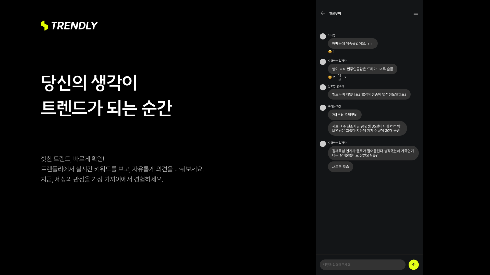

# 🔍 프로젝트명: TRENDLY

> 실시간 트렌드 분석과 채팅이 결합된 멀티 플랫폼 커뮤니티 서비스


---

## 📌 개요

**목표**
10주 동안의 단기 집중 협업을 통해, 실시간으로 수집한 다양한 트렌드 키워드를 분석하고, 이를 바탕으로 사용자 간 소통이 가능한 커뮤니티 플랫폼 개발

**주요 기능**
- 실시간 트렌드 데이터 수집 및 시각화
- 트렌드 기반 채팅

## ⏰ 프로젝트 기간
- 진행 기간: 2025.02.03 ~ 2025.04.07 (총 10주)
- 참여 형태: 팀 프로젝트 (기획 2명, 디자인 2명, 백엔드 2명, 프론트엔드 1명)

## 🛠️ 사용 기술

**Frontend**
- React
- Next.js
- Zustand
- Tailwind CSS
- shardcn

**DevOps & Tools**
- AWS (E2C)
- Jenkins
- pnpm
- ESLint
- Prettier
- Husky
- Figma

## 🚀 프로젝트 실행 방법

1. 의존성 설치
```
   pnpm install
```
2. 개발 서버 실행
```
   pnpm dev
```
